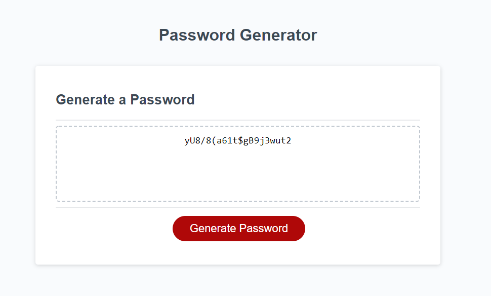

# password-generator
Challenge 3 JS

## Website

[Generate your password here!](https://fchoi1.github.io/password-generator/)

## Technologies
Made using HTML, CSS, and Javascript

## Screenshot

## How to use the password generator

1. Select Criteria: 
    * Length: Specify Passowrd Length

    * Character: Specify types of characters used in password

    * Both: Specify password length and character types
    
    * Default: Use default password generator settings

        

2. Enter password length (if Applicable):

    * Specify number between 8 and 128 characters

    * Default password length is randomize between 8 and 128 characters

        

3. Specify types of characters used:

    Series of prompts to select which types of characters to use:

    * Lowercase: include lowercase letters in password (Default option)

        

    * UpperCase: include Uppercase letters in password 

        

    * Special Case: include Special characters (" !\"#$%&'()*+,-./:;<=>?@[]^_`{|}~\") in password 

        

    * Number Case: include numbers in password

        

4. Password Generated from criteria:

